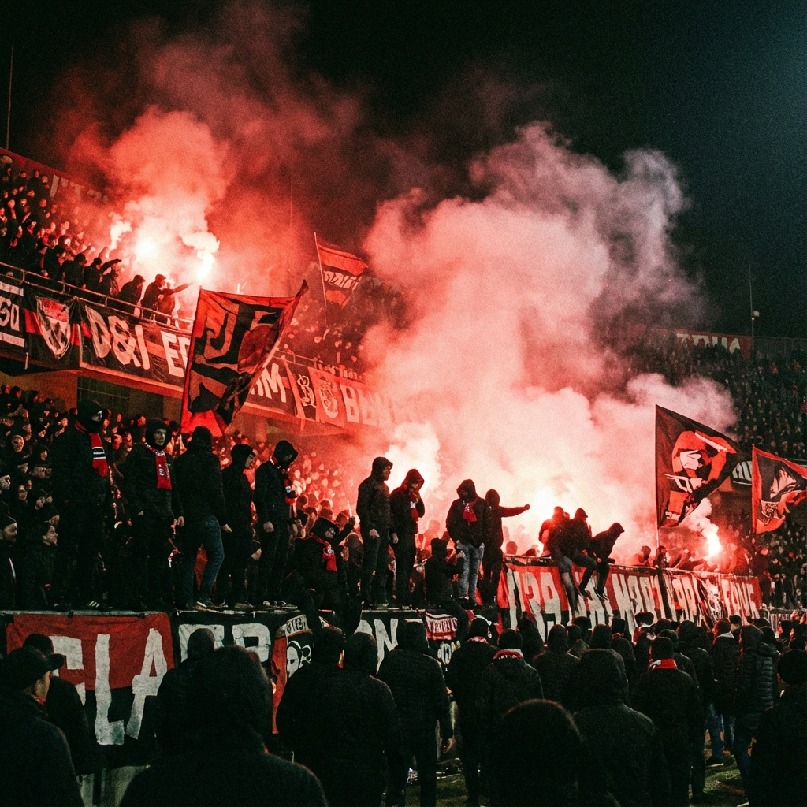

# 🐺 Dogtownlads - Terror of Terrace

**Dogtownlads** is a dynamic streetwear e-commerce website themed around **Football Ultras** culture. Built with **Native PHP** and **Tailwind CSS**, it features a raw, aggressive aesthetic ("Actions. History. Pride.") and a functional catalog system.



## 🔥 Features

### 🛍️ Public Interface
*   **Dynamic Catalog**: Displays products from a JSON file.
*   **Whatsapp Checkout**: Direct integration with WhatsApp API.
    *   **Ready Stock**: "Saya mau order..."
    *   **Preorder**: "Saya mau ikut PO..."
*   **Responsive Design**: Mobile-first layout with custom "Oswald" & "Anton" typography.
*   **Ultras Aesthetic**: Custom animations (`breathing` logo), pyro backgrounds, and street-style interactions.

### 🎛️ Admin Dashboard
*   **Authentication**: Simple login protection.
*   **Product Management**: Add, Edit, Delete products easily.
*   **Stock Status**: Manage status tags (`READY`, `LOW STOCK`, `SOLD OUT`, `PREORDER`).
*   **Stats Overview**: View total assets and stock counts.
*   **No Database Needed**: Data uses a flat-file JSON system (`data/products.json`), making it portable and easy to host anywhere.

## 🛠️ Tech Stack
*   **Backend**: PHP (Native, >= 8.0)
*   **Frontend**: Tailwind CSS (CDN), Alpine.js / Vanilla JS
*   **Data**: JSON Flat-file
*   **Fonts**: Anton, Oswald, Aerosoldier (Custom)
*   **Animations**: AOS Library

## 🚀 How to Run Locally

1.  **Clone the Repository**
    ```bash
    git clone https://github.com/mhdverel/dogtownlads-official.git
    cd dogtownlads-official
    ```

2.  **Start PHP Server**
    You can use the built-in PHP server:
    ```bash
    php -S localhost:8000
    ```

3.  **Access the Website**
    Open your browser and go to:
    *   **Frontend**: `http://localhost:8000`
    *   **Admin Panel**: `http://localhost:8000/admin`

## 🔑 Admin Credentials
Since this is a flat-file demo version, the default login is:
*   **Password**: `admin123`

*(Note: For production usage, please upgrade to a Database system for better security.)*

## 📂 Project Structure
```
dogtownlads/
├── admin/          # Admin panel logic (Add/Edit/Delete)
├── assets/         # Images, Fonts, Favicon
├── data/           # products.json (Database file)
├── includes/       # Layout partials (Header/Footer)
├── index.php       # Homepage
├── catalog.php     # Product listing
└── contact.php     # Contact & Location
```

---
*Built with passion for Street Culture.* 
**© 2025 Dogtownlads.**
